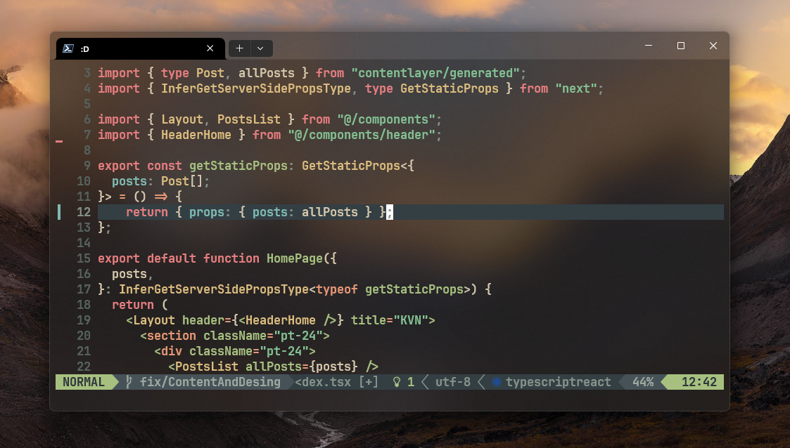
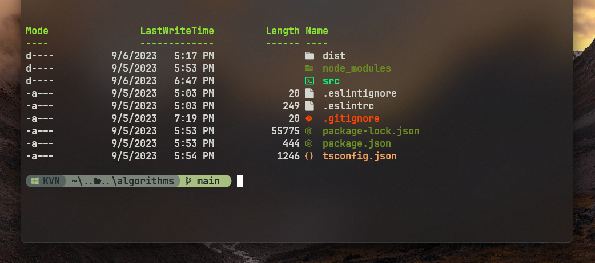

# Kevin's dotfiles

use my configuration with carefully, make sure you understand the configuration above
cuse this configuration works fine for me

## Contents

- hyprland
- kitty
- tmux
- fish
- waybar
- wofi

- vim (NeoVim) config
  [nvim config](https://github.com/Kevin-Illu/nvim-config)
  

- PowerShell config
  
  [powershell config docs](./docs/powershell.md)
